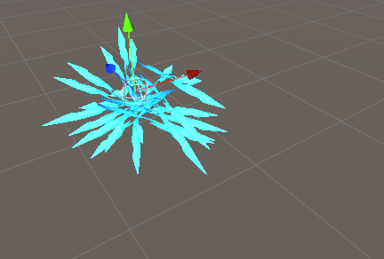
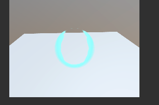
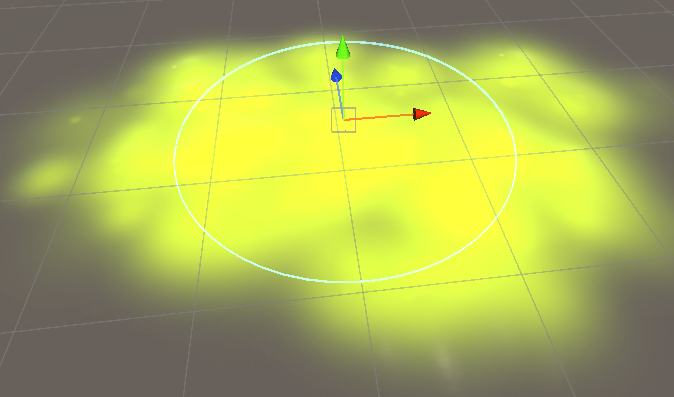
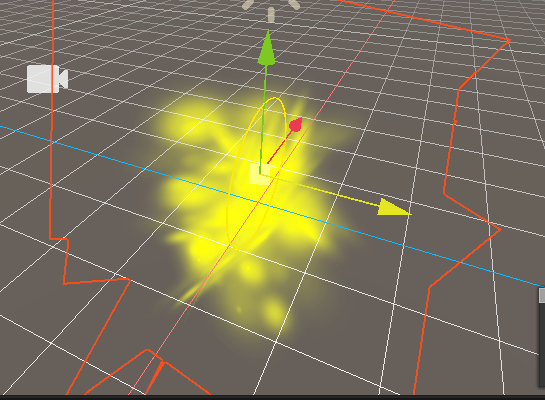

# 疑似源码问题清单

> 文档编写过程中发现的疑似源码问题，未直接改源码，记录在此交作者决定。每条：文件 + 现象 + 根因 + 修复方向 + 状态。

---

## #1 Help 菜单两个链接：打不开 + 打反
**文件**：`Editor/Export/ServeConfig.cs`（菜单在 `LayaAir3D.cs:40-50`）
**现象**：点 `Help/Study`（学习）、`Help/Answsers`（问答）**没反应**（打不开）。
**根因**：
1. **打不开（主因）**：两个 URL 不硬编码，而是运行时从远程配置 `https://ldc-...myqcloud.com/layaair/unity/ExportPlugin.conf` 拉取（`initConfig:34-53`）。该地址**现已返回 403 Forbidden**（实测）→ `request.error` 非空 → 只 `ExportLogger.Error` 记日志、**失败分支不调回调 `ac()`**（:40-43）→ `_openUrl` 不执行 → 点击无反应。无任何硬编码兜底 URL。
2. **打反**：即使配置能加载，`_openUrl`（:65-74）把枚举接到相反字段——`LayaAskURL` 开 `Study`、`StudyURL` 开 `LayaAsk`。
3. **附带**：`_isGetConfig` 声明 false 后**从未置 true**（成功分支 :44-52 漏写）→ 每次点击都重新拉取那个已 403 的地址。
**修复方向**：两个 Help URL 直接硬编码（最稳，静态链接无需远程配置）；或至少失败时回退硬编码 URL；并修 `_openUrl` 接反 + 成功后置 `_isGetConfig=true`。（远程 .conf 的 403 属作者 COS 桶权限问题，服务端处理。）
**状态**：✅ 源码 + 实测确认（配置 403 实测）。

---

## #2 只读包内不可读纹理导致整个导出崩溃中断 ⚠️ 已复现
**文件**：`Editor/Export/filter/TextureFile.cs`（`getTextureInfo` / `SaveFile:425`）、`ResoureMap.cs:337`
**现象**：导出 3D Game Kit `_TemplateScene` 时报 `Texture2D.GetPixels: texture data is not readable (GridBox_Default)` → 整个导出中断。
**根因**：崩溃纹理来自只读包 `PackageCache/com.unity.probuilder`（isReadable=0）。`getTextureInfo` 虽会临时设 isReadable=true 再 reimport，但**只读/不可变包内的资源改不了导入设置**，仍不可读 → `SaveFile` 的 `GetPixels()` 抛异常；且 `SaveAllFile` 保存循环**无 try-catch**，一张坏图 = 整体失败。
**修复方向**：`GetPixels` 加 try-catch 跳过坏图 + `SaveAllFile` 加 per-file try-catch（单文件失败计警告、不中断）。
**状态**：已复现；勾 Read/Write 对只读包无效。当前绕过：用一次性工具把场景里引用只读包材质的 Renderer 换成可读材质。

---

## #3 自定义 Shader 转 GLSL 不可靠（编译失败 / 静默失真）
**文件**：`Editor/Export/.../CustomShaderExporter.cs`（HLSL→GLSL 转换）
**现象**：`_TemplateScene` 导出的 3 个自定义 shader 各有问题、无一干净：
- **Swish**（手写）→ `Unlit_Swish_D3`：Laya 端 GLSL 编译报错（0:126/128 `texture` 重载不匹配、`.rrrr` swizzle 非法、vec4/vec3 维度不匹配）。
- **Shield**（表面着色器 `#pragma surface`）→ `Custom_Shield_D3`：静默失真——`surf()` 塞进 VS/FS 却无人调用（死代码）、VS `gl_Position` 未赋值即用、FS 退化成通用贴图、uniformMap 与正文变量名不一致。
- **ProBuilder 顶点色** → `..._D3`：GLSL 有效但被转成 **2D BaseRender**（`D2_BaseRenderNode2D` / `Sprite2DFrag`），与 `_D3` 网格用途矛盾，疑似 renderer 类型误判。
**归纳**：`#pragma surface` 表面着色器是转换盲区；未知 HLSL 类型兜底 `vec4` 易引发维度错。属转换能力边界。
**绕过**：关「启用自定义 Shader 自动导出」→ 未注册 shader 不再生成编译不过的 `_D3`（代价：自定义外观丢失）。
**状态**：3 种失败形态已坐实，写入 custom-shader 页。

---

## #4 不导出 Animator BlendTree（混合树）→ 状态变空壳
**文件**：`ResoureMap.cs` `GetAnimaterLayerData`
**现象**：`Ellen.controller` 的 `Hurt` 是 BlendTree（8 个方向受击 clip），导出后 `Hurt` 成空状态（无 clip 无 blendTree），其内 clip 全丢；Laya 引用空状态时报 `Cannot read properties of undefined (reading 'state')`。
**根因**：`GetAnimaterLayerData` 只在 `state.motion as AnimationClip` 时导出 clip，不处理 `state.motion is BlendTree`。直接挂单 clip 的状态（Death/Spawn）正常。
**修复方向**：增加 BlendTree 分支（导出混合树，或至少其内 clip + 默认 motion）。
**遗留**：`set null.x`（`WebAnimatorApplier.js:1018`）骨骼名都在却 null，疑为 `.lani` 路径解析问题，待逆向。
**状态**：BlendTree 不导出已坐实（截图为证）；`set null.x` 待深挖。

---

## #5 相机由脚本 Rig 驱动 → Laya 端视角不对（非纯 bug）
**文件**：`ResoureMap.cs:543-556`（MonoBehaviour 仅在有 UUID 映射时导出）
**现象**：导出场景在 Laya 端相机位置/角度与游戏视角不符。
**根因**：相机是 Game Kit 的 `KeyboardAndMouseFreeLookRig` 脚本驱动；脚本未配 UUID 映射 → 不导出 → Laya 里相机只剩静态 transform、无运行时 rig 驱动。属脚本逻辑能力边界（已在 index.html 声明）。
**绕过**：Laya 里手动调相机，或 Unity 里摆固定视角再导。
**状态**：已定位，非阻塞。

---

## #6 `ExportLogger.Log` 是空实现 → 所有信息级日志被吞
**文件**：`Editor/Export/utils/ExportLogger.cs:5`
`Log(msg){}` 是空方法（`Warning`/`Error` 正常）。`GenerateConversionSummary`（`CustomShaderExporter.cs:1438`）等所有 `ExportLogger.Log(...)` 进度/摘要日志一律不进 Console。
**影响**：Console 看不到「Shader Export Summary」等转换摘要（转换结果实际在产物 `.shader` 文件里）。
**修复方向**：`Log` 接 `Debug.Log`（可加详细日志开关），或摘要写入报告文件。
**状态**：已坐实。

---

## #7 粒子 Mesh 顶点上限检测被注释屏蔽
**文件**：`Editor/Export/LayaParticleExportV2.cs:52-53`
`CheckParticleVertexLimit(...)` 调用被注释（方法与常量 `MAX_PARTICLE_VERTEX_COUNT=65535` 仍在）。Mesh 模式粒子导出不做超限检查，超限推迟到 Laya 运行时报错；配套的粒子 Mesh 自动简化（`ENABLE_PARTICLE_MESH_OPTIMIZATION`）也一并不生效。
**修复方向**：恢复调用，或加导出期超限告警。
**状态**：源码确认。

---

## #8 自定义 2D 精灵材质导出了 `.lmat` 却从未接线
**文件**：`ResoureMap.cs:898-905`（导出）/ `:1012-1023`（赋值处）
**现象**：`GetSpriteRendererComponentData` 检测到 SpriteRenderer 挂自定义材质后会生成 `.lmat`，但该 `materialFile` 此后从未被消费——`UI2DPrefabFile.sharedMaterial` 永远只传默认材质。自定义材质仅参与 `DetectTransparentRenderMode` 决定 renderMode。
**影响**：换了自定义材质的 2D 精灵，导出后仍用默认材质、效果丢失；磁盘多一个没被引用的 `.lmat`。
**修复方向**：把自定义 `materialFile.uuid` 真正赋给预制体；或不导出该 `.lmat` 并声明「2D 精灵不支持自定义材质」。
**状态**：源码确认；sprite-2d 页已加边界说明。

---

## #9 `MetarialPropData.json` 的 `SkyBox/Cubemap` 键大小写写错
**文件**：`Editor/MetarialPropData.json:474`
键写成 `"SkyBox/Cubemap"`（大写 B），Unity 真实 shader 名是 `"Skybox/Cubemap"`（小写 b），查表区分大小写 → 永远命中不了（且该项是空占位）。
**影响**：单张 Cubemap 天空盒导出查表失败、跳过、不生成 `.cubemap`。结论「不支持」对，但根因是键拼错。
**修复方向**：改键名并补全配置，或删掉误导性空占位。
**状态**：源码确认；material-shader 页用中性表述。

---

## #10 `needSetBlinnPhongSpecular` 判断恒不为 true（疑似死逻辑）
**文件**：`Editor/Export/utils/MetarialUitls.cs:899-901`
`if (!needSet && cList.Value != "u_MaterialSpecular") needSet = false;` —— 无任何路径能把 `needSet` 置 true，疑似条件写反。配套的「BlinnPhong 缺高光补默认 `(0.2,0.2,0.2,1)`」是否触发存疑。
**修复方向**：复核本意（大概率应为 `== "u_MaterialSpecular" → needSet = true`）。
**状态**：源码静态发现，未实测。

---

## #11 粒子 Cutout 材质导出丢失 alpha 裁剪 → Laya 渲染成不透明方片 ★
**文件**：`MetarialUitls.cs` `WriteParticleMaterial:1107`、`DetectTransparentRenderMode:460`
**现象**（实测）：`Spit` 粒子（Unity 材质 Cutout `_Mode:1`/`_Cutoff:0.034`）导出后在 Laya 整块不透明硬贴成方片。
**根因**：`DetectTransparentRenderMode` 只返回 AlphaBlend(2)/Additive(3)、**无 Cutout 分支**；粒子路径 `WriteParticleMaterial` **不写** `alphaTest`/`alphaTestValue`（只有普通材质路径写）→ Cutout 被当 AlphaBlend、混合因子照抄 ONE/ZERO（不透明）、无 alpha 裁剪。
**修复方向**：识别 Cutout 后补 `alphaTest`/`alphaTestValue`，或按 AlphaBlend 写正确混合因子（SrcAlpha/OneMinusSrcAlpha）。
**绕过**：Unity 把该材质 Rendering Mode 由 Cutout 改 Fade。
**状态**：源码 + 实测确认。关联 #12。

---

## #12 `ConvertUnityBlendToLaya` 混合因子映射写反 → alpha 混合粒子渲染错 ★★
**文件**：`MetarialUitls.cs:1451` `ConvertUnityBlendToLaya`
**现象**（实测）：Fade 材质导出 `s_BlendSrc:6`/`s_BlendDst:3`，正解应为 6/**7**；相机里粒子成带色边浑浊半透。
**根因**：Unity 枚举 `6`=OneMinusSrcColor、`10`=OneMinusSrcAlpha；Laya `3`=OneMinusSourceColor、`7`=OneMinusSourceAlpha。代码 `case 6:return 7` / `case 10:return 3` 把两者认反（注释 `[FIXED: was 3/7]` 表明原本正确、被错改）。
**影响**：所有 alpha 混合（Fade/Transparent）粒子渲染错（主流半透模式）；Additive/Opaque 不受影响。
**修复**（高置信，等同还原误改）：`case 6: return 3;` / `case 10: return 7;`
**状态**：源码 + 实测 + 双枚举三重确认。关联 #11。

---

## #13 Stretch（速度拉伸广告牌）粒子在 Laya 渲染塌陷
**文件**：`LayaParticleExportV2.cs:149-156`（参数已正确写出）；现象在 Laya 渲染端
**现象**（实测）：`HitParticle` 在 Unity 是放射尖刺星芒，导出后尖刺全丢、只剩中央细环。

| Unity 正常 | Laya 塌环 |
|---|---|
|  |  |

**数据**：尖刺渲染器 `m_RenderMode:1`(Stretch)/`LengthScale:0`/`VelocityScale:0.1`/`alignment:4`(Velocity)。产物已正确写 `renderMode:1` + `stretchedBillboardSpeedScale:0.1` + `stretchedBillboardLengthScale:0`。
**根因**：导出端无误；Laya 渲染端对 `stretchedBillboardLengthScale:0`（长度纯靠速度拉伸）的处理与 Unity 不一致 → 尖刺退化成近零长度。次要：alignment 不导出（见 #14）。
**状态**：⚠ 导出端正确、Laya 渲染未复现，根因待 Laya 侧确认。

---

## #14 粒子渲染对齐方式（RenderAlignment）完全不导出 → Billboard 朝向错
**文件**：`LayaParticleExportV2.cs`（无 `psr.alignment` 导出逻辑，`:158-166` 仅注释掉的警告）
**现象**（实测）：`AcidSplash` 在 Unity 平躺贴地（World 对齐），导出后在 Laya 立了起来。

| Unity 平躺（正确） | Laya 立起（错误） |
|---|---|
|  |  |

**数据**：渲染器1 Billboard + `m_RenderAlignment:1`(World)；产物无 alignment 字段。
**根因**：`ParticleSystemRenderer.alignment`（View/World/Local/Facing/Velocity）不导出 → Laya 退回默认 View（朝相机）→ 朝向错。默认 View 的粒子不受影响。
**修复方向**：导出 `psr.alignment` 并映射到 Laya 对齐字段。
**状态**：源码 + 实测确认。关联 #13。

---

